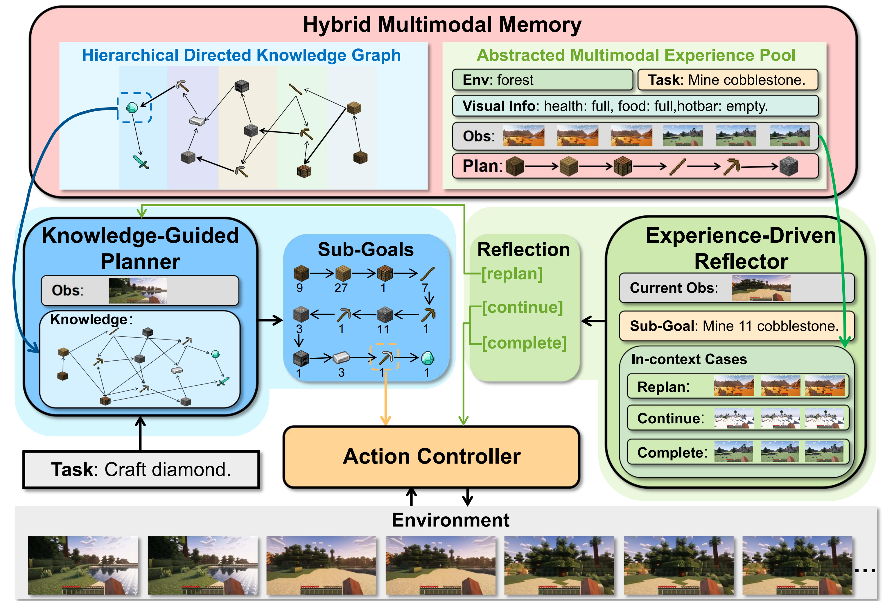

# Awesome-Minecraft-Agents

## Our Minecraft Agent

 **Optimus-1: Hybrid Multimodal Memory Empowered Agents Excel in Long-Horizon Tasks**  

    

 [[🍎 Project Page](https://cybertronagent.github.io/Optimus-1.github.io/)] [[📖 arXiv Paper](https://arxiv.org/abs/2408.03615)] [[🌟 GitHub](https://github.com/JiuTian-VL/Optimus-1)] 

The VITA team proposes Freeze-Omni, a speech-to-speech dialogue model with both low-latency and high intelligence while the training process is based on a frozen LLM. 🌟 

Freeze-Omni exhibits the characteristic of being **smart** as it is constructed upon a **frozen** text-modality LLM. This enables it to keep the original intelligence of the LLM backbone, without being affected by the forgetting problem induced by the fine-tuning process for integration of the speech modality. ✨ 

---

<b> Table of Contents </b> 

- [Awesome Policy](#awesome-policy)
  - [Vision-driven Policy](#vision-driven-policy)
  - [Goal-conditioned Policy](#goal-conditioned-policy)
  
- [Awesome Agent](#awesome-agents)
  - [Policy-based Agent](#policy-based-agent)
  - [Code-based Agent](#code-based-agent)

---

# Awesome Policy

## Vision-driven Policy
|  Title  |   Venue  |   Year   |   Code   |   Demo   |
|:--------|:--------:|:--------:|:--------:|:--------:|
|    [**Video PreTraining (VPT): Learning to Act by Watching Unlabeled Online Videos**](https://arxiv.org/abs/2206.11795)   | NeurIPS | 2022 | [Github](https://github.com/openai/Video-Pre-Training) | - | 
|    [**GROOT: Learning to Follow Instructions by Watching Gameplay Videos**](https://arxiv.org/abs/2310.08235)   | ICLR | 2024 | [Github](https://github.com/CraftJarvis/GROOT) | [Demo](https://craftjarvis.github.io/GROOT/)| 

## Goal-conditioned Policy
|  Title  |   Venue  |   Year   |   Code   |   Demo   |
|:--------|:--------:|:--------:|:--------:|:--------:|
|    [**MineDojo: Building Open-Ended Embodied Agents with Internet-Scale Knowledge**](https://arxiv.org/abs/2206.08853)   | NeurIPS | 2022 | [Github](https://github.com/MineDojo/MineDojo) | [Demo](https://minedojo.org/) |
|    [**Mastering Diverse Domains through World Models**](https://arxiv.org/abs/2301.04104v2)   | Arxiv | 2023 | [Github](https://github.com/danijar/dreamerv3) | [Demo](https://danijar.com/project/dreamerv3/) |
|    [**STEVE-1: A Generative Model for Text-to-Behavior in Minecraft**](https://arxiv.org/abs/2306.00937)   | NeurIPS | 2023 | [Github](https://github.com/Shalev-Lifshitz/STEVE-1) | [Demo](https://sites.google.com/view/steve-1) |
|    [**Open-World Multi-Task Control Through Goal-Aware Representation Learning and Adaptive Horizon Prediction**](https://arxiv.org/abs/2301.10034)   | CVPR | 2023 | [Github](https://github.com/CraftJarvis/MC-Controller) | - |
|    [**MineDreamer: Learning to Follow Instructions via Chain-of-Imagination for Simulated-World Control**](https://arxiv.org/abs/2403.12037)   | NeurIPS Workshop | 2024 | [Github](https://github.com/Zhoues/MineDreamer/) | [Demo](https://sites.google.com/view/minedreamer/main)| 
| [**Vision-Language Models Provide Promptable Representations for Reinforcement Learning**](https://arxiv.org/abs/2402.02651)   | Arxiv | 2024 | [Github](https://github.com/pr2l/pr2l.github.io/tree/master/static/notebooks) | - | 
|    [**ROCKET-1: Mastering Open-World Interaction with Visual-Temporal Context Prompting**](https://arxiv.org/abs/2410.17856)   | Arxiv | 2024 | [Github](https://github.com/CraftJarvis/ROCKET-1) | [Demo](https://craftjarvis.github.io/ROCKET-1/) | 

---

# Awesome Agent

## Policy-based Agent
|  Title  |   Venue  |   Year  |   Code   |   Demo   |
|:--------|:--------:|:--------:|:--------:|:--------:|
|    [**Describe, Explain, Plan and Select: Interactive Planning with Large Language Models Enables Open-World Multi-Task Agents**](https://arxiv.org/abs/2302.01560)   | NeurIPS | 2023 | [Github](https://github.com/CraftJarvis/MC-Planner) | [Demo](https://craftjarvis.github.io/) |
|    [**Skill Reinforcement Learning and Planning for Open-World Long-Horizon Tasks**](https://arxiv.org/abs/2303.16563)   | NeurIPS Workshop | 2023 | [Github](https://github.com/PKU-RL/Plan4MC) | [Demo](https://sites.google.com/view/plan4mc) |
| [**LLaMA Rider: Spurring Large Language Models to Explore the Open World**](https://arxiv.org/abs/2310.08922)   | Arxiv | 2023 | - | - |
|    [**JARVIS-1: Open-World Multi-task Agents with Memory-Augmented Multimodal Language Models**](https://arxiv.org/abs/2311.05997)   | NeurIPS Workshop | 2023| [Github](https://github.com/CraftJarvis/JARVIS-1) | [Demo](https://craftjarvis-jarvis1.github.io/) |
|    [**Optimus-1: Hybrid Multimodal Memory Empowered Agents Excel in Long-Horizon Tasks**](https://arxiv.org/abs/2408.03615)   | NeurIPS | 2024 | [Github](https://github.com/JiuTian-VL/Optimus-1) | [Demo](https://cybertronagent.github.io/Optimus-1.github.io/) | 
|    [**MP5: A Multi-modal Open-ended Embodied System in Minecraft via Active Perception**](https://arxiv.org/abs/2312.07472)   | CVPR | 2024 | [Github](https://github.com/IranQin/MP5) | [Demo](https://iranqin.github.io/MP5.github.io/) | 
|    [**OmniJARVIS: Unified Vision-Language-Action Tokenization Enables Open-World Instruction Following Agents**](https://arxiv.org/abs/2407.00114)   | NeurIPS | 2024 | [Github](https://github.com/CraftJarvis/OmniJarvis) | [Demo](https://omnijarvis.github.io/) | 

## Code-based Agent
|  Title  |   Venue  |   Year   |   Code   |   Demo   |
|:--------|:--------:|:--------:|:--------:|:--------:|
|    [**Voyager: An Open-Ended Embodied Agent with Large Language Models**](https://arxiv.org/abs/2305.16291)   |  NeurIPS | 2023 | [Github](https://github.com/MineDojo/Voyager) | [Demo](https://voyager.minedojo.org/) |
|    [**Ghost in the Minecraft: Generally Capable Agents for Open-World Environments via Large Language Models with Text-based Knowledge and Memory**](https://arxiv.org/abs/2305.17144)   |  Arxiv | 2023 | [Github](https://github.com/OpenGVLab/GITM) | - |
|    [**Creative Agents: Empowering Agents with Imagination for Creative Tasks**](https://arxiv.org/abs/2312.02519)   |  Arxiv | 2023 | [Github](https://github.com/PKU-RL/Creative-Agents) | [Demo](https://sites.google.com/view/creative-agents) |
|  [**Auto MC-Reward: Automated Dense Reward Design with Large Language Models for Minecraft**](https://arxiv.org/abs/2312.09238)   | CVPR | 2024 | - | [Demo](https://yangxue0827.github.io/auto_mc-reward.html) |
|    [**Odyssey: Empowering Minecraft Agents with Open-World Skills**](https://arxiv.org/abs/2407.15325)   |  Arxiv | 2024 | [Github](https://github.com/zju-vipa/Odyssey) | - |
|    [**See and Think: Embodied Agent in Virtual Environment**](https://arxiv.org/abs/2311.15209)   |  ECCV | 2024 | [Github](https://github.com/rese1f/STEVE) | [Demo](https://rese1f.github.io/STEVE/) |
| [**RL-GPT: Integrating Reinforcement Learning and Code-as-policy**](https://arxiv.org/abs/2402.19299)   |  Arxiv | 2024 | - | [Demo](https://sites.google.com/view/rl-gpt) |
| [**LARM: Large Auto-Regressive Model for Long-Horizon Embodied Intelligence**](https://arxiv.org/abs/2405.17424)   |  Arxiv | 2024 | - | [Demo](https://lizhuoling.github.io/LARM_webpage/) |
| [**Luban: Building Open-Ended Creative Agents via Autonomous Embodied Verification**](https://arxiv.org/abs/2405.15414)   |  Arxiv | 2024 | - | - |

